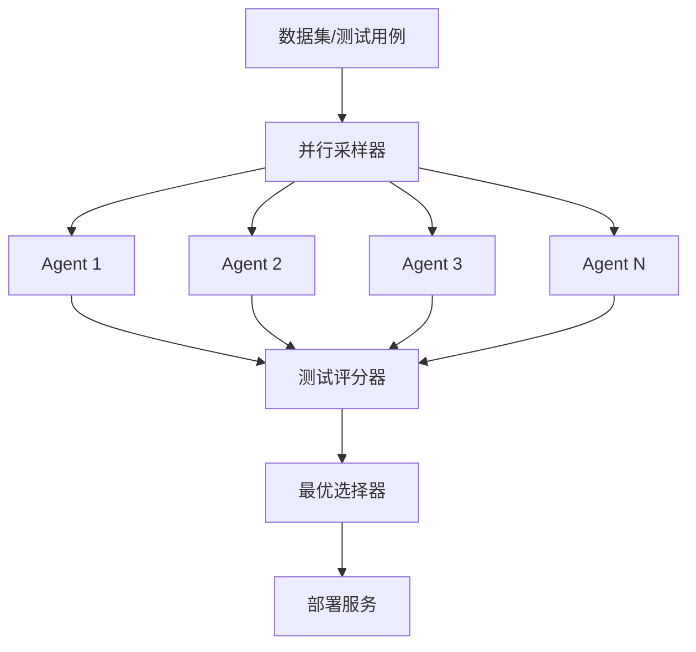

# 黑盒开发完整教程：从数据集到服务部署

## 目录
1. [项目概述](#1-项目概述)
2. [环境准备](#2-环境准备)
3. [构建数据集](#3-构建数据集)
4. [并行采样开发](#4-并行采样开发)
5. [测试与选择](#5-测试与选择)
6. [服务部署](#6-服务部署)
7. [完整实战案例](#7-完整实战案例)
8. [进阶技巧](#8-进阶技巧)

---

## 1. 项目概述

### 1.1 什么是黑盒开发？

黑盒开发是一种革命性的软件开发模式，其核心理念是：

```
输入（测试用例） → 黑盒（多个AI Agent并行开发） → 输出（最优实现）
```

### 1.2 核心组件



### 1.3 与传统开发的区别

| 维度 | 传统开发 | 黑盒并行采样 |
|-----|---------|-------------|
| 开发模式 | 先编码后测试 | 先定义测试，后生成代码 |
| 执行方式 | 单线程串行 | 多Agent并行 |
| 质量保证 | 人工review | 自动测试评分 |
| 优化方式 | 调试修复 | 竞争选择 |
| 成功率 | 依赖个人能力 | 概率保证 |

---

## 2. 环境准备

### 2.1 安装依赖

```bash
# 基础依赖
pip install fastapi uvicorn pydantic requests pyyaml

# 可选：如果使用真实AI Agent
pip install openai anthropic google-generativeai

# 克隆项目
git clone https://github.com/erliufashi/bbo-2.git
cd bbo-v2-2-codex
git checkout parallel-sampling-test
```

### 2.2 项目结构

```
bbo-v2-2-codex/
├── orchestrator/           # 编排器核心代码
├── test_parallel_sampling/ # 并行采样测试
│   ├── services/          # 服务定义
│   ├── parallel_sampling_orchestrator.py
│   └── simple_parallel_sampling.py
└── spec.md                # 设计规范
```

---

## 3. 构建数据集

### 3.1 数据集的本质

在黑盒开发中，**数据集 = 测试用例 = 服务规范**。数据完全定义了服务的行为。

### 3.2 服务定义结构

#### 3.2.1 创建服务定义 (service_definition.yaml)

```yaml
version: "1.0"
service:
  name: user-service
  language: python
  runtime:
    image: "python:3.11-slim"
    start_cmd: ["uvicorn", "app.main:app", "--host", "0.0.0.0", "--port", "8000"]
    port: 8000

tests:
  suite_file: tests/test_cases.json
  
  # 评分器定义
  registered_scorers:
    exact_status:
      kind: exact_match
      config:
        json_paths: ["$.status"]
    
    response_schema:
      kind: exact_match
      config:
        json_paths: ["$.body"]
        allow_placeholders:
          "<uuid>": "uuid_v4"
          "<any-non-empty>": "non_empty"
    
    business_logic:
      kind: custom_script
      config:
        entrypoint: "tests/scorers/validate.py:score"
  
  # 聚合策略
  default_aggregator:
    kind: weighted_sum
    weights:
      exact_status: 0.3
      response_schema: 0.4
      business_logic: 0.3
    pass_threshold: 0.8
```

#### 3.2.2 定义测试用例 (test_cases.json)

```json
[
  {
    "id": "create-user",
    "description": "创建新用户",
    "tags": ["core", "smoke"],
    "request": {
      "method": "POST",
      "path": "/users",
      "headers": {
        "Content-Type": "application/json"
      },
      "json": {
        "username": "testuser",
        "email": "test@example.com",
        "password": "SecurePass123"
      }
    },
    "expected": {
      "status": 201,
      "json": {
        "id": "<uuid>",
        "username": "testuser",
        "email": "test@example.com",
        "created_at": "<any-non-empty>"
      }
    },
    "scoring": {
      "scorers": [
        {"use": "exact_status"},
        {"use": "response_schema"},
        {"use": "business_logic"}
      ]
    }
  },
  {
    "id": "get-user",
    "description": "获取用户信息",
    "tags": ["core"],
    "request": {
      "method": "GET",
      "path": "/users/123e4567-e89b-12d3-a456-426614174000"
    },
    "expected": {
      "status": 200,
      "json": {
        "id": "123e4567-e89b-12d3-a456-426614174000",
        "username": "<any-non-empty>",
        "email": "<any-non-empty>",
        "created_at": "<any-non-empty>"
      }
    }
  },
  {
    "id": "user-not-found",
    "description": "用户不存在",
    "tags": ["error-handling"],
    "request": {
      "method": "GET",
      "path": "/users/nonexistent"
    },
    "expected": {
      "status": 404,
      "json": {
        "error": "User not found"
      }
    }
  }
]
```

### 3.3 数据集设计原则

#### 3.3.1 完整性
- 覆盖所有核心功能
- 包含正常和异常场景
- 边界条件测试

#### 3.3.2 可验证性
- 明确的输入输出
- 可量化的评分标准
- 支持自动化验证

#### 3.3.3 渐进性
- 分级测试（smoke → core → full）
- 优先级标记
- 迭代改进

### 3.4 创建完整服务包

```bash
# 创建目录结构
mkdir -p services/user-service/{app,tests/scorers,data,api}

# 目录结构
services/user-service/
├── service_definition.yaml  # 服务定义
├── api/
│   └── openapi.yaml        # API规范
├── tests/
│   ├── test_cases.json     # 测试用例
│   └── scorers/            # 自定义评分器
│       └── validate.py
├── data/                   # 业务数据
│   └── seed_data.json
└── app/                    # 生成的代码（初始为空）
```

---

## 4. 并行采样开发

### 4.1 并行采样器架构

```python
class ParallelSamplingOrchestrator:
    """并行采样编排器"""
    
    def __init__(self, num_agents: int = 5):
        self.num_agents = num_agents  # 并行Agent数量
        self.agents = []              # Agent池
    
    def parallel_sampling(self, task: ServiceTask) -> List[AgentResult]:
        """核心：并行采样"""
        with ThreadPoolExecutor(max_workers=self.num_agents) as executor:
            futures = []
            for i in range(self.num_agents):
                # 每个Agent独立开发
                future = executor.submit(self.agent_develop, task, f"agent-{i}")
                futures.append(future)
            
            # 收集所有结果
            results = [f.result() for f in futures]
            return results
```

### 4.2 Agent开发流程

每个Agent的工作流程：

```python
def agent_develop(self, task: ServiceTask, agent_id: str) -> AgentResult:
    """单个Agent的开发流程"""
    
    # 1. 生成开发提示
    prompt = self.generate_prompt(task)
    
    # 2. 调用AI生成代码
    code = self.call_ai_agent(prompt, agent_id)
    
    # 3. 保存到临时目录
    work_dir = self.create_work_dir(agent_id)
    self.save_code(work_dir, code)
    
    # 4. 运行测试
    test_results = self.run_tests(work_dir, task)
    
    # 5. 计算得分
    score = self.calculate_score(test_results)
    
    return AgentResult(
        agent_id=agent_id,
        code=code,
        test_results=test_results,
        score=score
    )
```

### 4.3 提示工程

为每个Agent生成不同的提示，增加多样性：

```python
def generate_prompt(self, task: ServiceTask, agent_id: str) -> str:
    """生成Agent提示"""
    
    # 基础要求
    base = f"创建 {task.service_name} 服务，实现以下端点:\n"
    
    # 添加测试用例要求
    for test in task.test_cases:
        base += f"- {test['request']['method']} {test['request']['path']}\n"
    
    # 添加随机性（不同的编程风格）
    styles = [
        "使用面向对象设计",
        "使用函数式编程",
        "使用async/await",
        "最小化代码量",
        "添加详细错误处理"
    ]
    style = random.choice(styles)
    
    return base + f"\n编程风格：{style}"
```

---

## 5. 测试与选择

### 5.1 自动化测试流程

```python
def run_tests(self, service_dir: Path, test_cases: List[dict]) -> TestResult:
    """自动运行测试"""
    
    # 1. 启动服务
    process = self.start_service(service_dir)
    
    try:
        # 2. 等待服务就绪
        self.wait_for_service(port=8000)
        
        # 3. 执行测试用例
        results = []
        for test_case in test_cases:
            result = self.execute_test_case(test_case)
            results.append(result)
        
        # 4. 汇总结果
        return self.aggregate_results(results)
        
    finally:
        # 5. 停止服务
        process.terminate()
```

### 5.2 评分机制

#### 5.2.1 精确匹配评分器

```python
class ExactMatchScorer:
    """精确匹配评分"""
    
    def score(self, expected: Any, actual: Any) -> float:
        """比较期望和实际结果"""
        if expected == actual:
            return 1.0
        return 0.0
```

#### 5.2.2 模式匹配评分器

```python
class PatternScorer:
    """支持占位符的评分器"""
    
    def score(self, expected: dict, actual: dict) -> float:
        """支持 <uuid>, <any-non-empty> 等占位符"""
        score = 0
        total = len(expected)
        
        for key, expected_value in expected.items():
            actual_value = actual.get(key)
            
            if expected_value == "<uuid>":
                if self.is_valid_uuid(actual_value):
                    score += 1
            elif expected_value == "<any-non-empty>":
                if actual_value:
                    score += 1
            elif expected_value == actual_value:
                score += 1
        
        return score / total
```

#### 5.2.3 业务逻辑评分器

```python
class BusinessLogicScorer:
    """自定义业务逻辑验证"""
    
    def score(self, test_case: dict, response: dict) -> float:
        """验证业务规则"""
        # 例如：验证创建时间格式
        if 'created_at' in response:
            try:
                datetime.fromisoformat(response['created_at'])
                return 1.0
            except:
                return 0.0
        return 0.5
```

### 5.3 选择最优实现

```python
def select_best_implementation(results: List[AgentResult]) -> AgentResult:
    """选择最优实现"""
    
    # 1. 按得分排序
    sorted_results = sorted(results, key=lambda x: x.score, reverse=True)
    
    # 2. 输出统计
    print(f"得分分布：")
    for r in sorted_results:
        print(f"  Agent-{r.agent_id}: {r.score:.2%}")
    
    # 3. 选择最高分
    best = sorted_results[0]
    
    # 4. 如果得分过低，可以触发新一轮采样
    if best.score < 0.8:
        print(f"⚠️ 最高分仅 {best.score:.2%}，建议增加采样")
    
    return best
```

---

## 6. 服务部署

### 6.1 部署最优代码

```python
def deploy_best_implementation(best: AgentResult, target_dir: Path):
    """部署选中的实现"""
    
    # 1. 清理目标目录
    if target_dir.exists():
        shutil.rmtree(target_dir)
    target_dir.mkdir(parents=True)
    
    # 2. 复制代码
    shutil.copy2(best.code_path, target_dir / "main.py")
    
    # 3. 创建依赖文件
    create_requirements_txt(target_dir)
    create_dockerfile(target_dir)
    
    # 4. 验证部署
    verify_deployment(target_dir)
    
    print(f"✅ 部署成功：{target_dir}")
```

### 6.2 创建Docker镜像

```python
def create_dockerfile(service_dir: Path):
    """创建Dockerfile"""
    
    dockerfile = """
FROM python:3.11-slim

WORKDIR /app

COPY requirements.txt .
RUN pip install --no-cache-dir -r requirements.txt

COPY . .

EXPOSE 8000

CMD ["uvicorn", "app.main:app", "--host", "0.0.0.0", "--port", "8000"]
"""
    
    with open(service_dir / "Dockerfile", "w") as f:
        f.write(dockerfile)
```

### 6.3 启动服务

```bash
# 本地启动
cd services/user-service
uvicorn app.main:app --reload

# Docker启动
docker build -t user-service .
docker run -p 8000:8000 user-service

# Docker Compose（多服务）
docker-compose up
```

---

## 7. 完整实战案例

### 7.1 开发一个用户服务

```python
#!/usr/bin/env python3
"""完整的黑盒开发流程示例"""

from pathlib import Path
import json
import yaml

def main():
    print("🚀 黑盒开发实战：用户服务")
    print("="*60)
    
    # Step 1: 准备数据集
    print("\n📝 Step 1: 构建数据集")
    service_dir = Path("services/user-service")
    service_dir.mkdir(parents=True, exist_ok=True)
    
    # 创建服务定义
    service_def = {
        "version": "1.0",
        "service": {
            "name": "user-service",
            "language": "python",
            "runtime": {
                "port": 8000
            }
        },
        "tests": {
            "suite_file": "tests/test_cases.json"
        }
    }
    
    with open(service_dir / "service_definition.yaml", "w") as f:
        yaml.dump(service_def, f)
    
    # 创建测试用例
    test_cases = [
        {
            "id": "create-user",
            "request": {
                "method": "POST",
                "path": "/users",
                "json": {
                    "username": "john",
                    "email": "john@example.com",
                    "password": "secret"
                }
            },
            "expected": {
                "status": 201,
                "json": {
                    "id": "<uuid>",
                    "username": "john",
                    "email": "john@example.com"
                }
            }
        },
        {
            "id": "get-user",
            "request": {
                "method": "GET",
                "path": "/users/{id}"
            },
            "expected": {
                "status": 200
            }
        }
    ]
    
    test_dir = service_dir / "tests"
    test_dir.mkdir(exist_ok=True)
    
    with open(test_dir / "test_cases.json", "w") as f:
        json.dump(test_cases, f, indent=2)
    
    print("  ✅ 数据集创建完成")
    print(f"  📁 位置: {service_dir}")
    
    # Step 2: 并行采样
    print("\n🔄 Step 2: 并行采样开发")
    from parallel_sampling_orchestrator import ParallelSamplingOrchestrator
    
    orchestrator = ParallelSamplingOrchestrator(num_agents=5)
    task = orchestrator.load_service_task(service_dir)
    
    # 运行3轮，每轮5个Agent
    best_overall = None
    for round_num in range(1, 4):
        print(f"\n  第 {round_num} 轮采样...")
        best, results = orchestrator.parallel_sampling(task, round_num)
        
        if best and (not best_overall or best.score > best_overall.score):
            best_overall = best
        
        if best_overall and best_overall.score >= 1.0:
            print(f"  ✅ 找到完美实现！")
            break
    
    # Step 3: 部署最优实现
    print("\n📦 Step 3: 部署服务")
    if best_overall:
        app_dir = service_dir / "app"
        app_dir.mkdir(exist_ok=True)
        
        with open(app_dir / "main.py", "w") as f:
            f.write(best_overall.code)
        
        print(f"  ✅ 部署 Agent-{best_overall.agent_id} 的实现")
        print(f"  📊 测试通过率: {best_overall.score:.2%}")
    
    # Step 4: 验证服务
    print("\n✨ Step 4: 验证服务")
    import subprocess
    import time
    import requests
    
    # 启动服务
    process = subprocess.Popen(
        ["uvicorn", "app.main:app", "--port", "8000"],
        cwd=str(service_dir)
    )
    
    time.sleep(3)  # 等待启动
    
    try:
        # 测试端点
        response = requests.post(
            "http://localhost:8000/users",
            json={
                "username": "test",
                "email": "test@test.com",
                "password": "password"
            }
        )
        
        if response.status_code == 201:
            print("  ✅ 服务验证成功！")
            print(f"  📡 响应: {response.json()}")
        else:
            print(f"  ❌ 服务验证失败: {response.status_code}")
    
    finally:
        process.terminate()
    
    print("\n" + "="*60)
    print("🎉 黑盒开发完成！")
    print("="*60)

if __name__ == "__main__":
    main()
```

### 7.2 运行结果

```
🚀 黑盒开发实战：用户服务
============================================================

📝 Step 1: 构建数据集
  ✅ 数据集创建完成
  📁 位置: services/user-service

🔄 Step 2: 并行采样开发

  第 1 轮采样...
  [Agent-1-1] 开发中... 得分: 60%
  [Agent-1-2] 开发中... 得分: 80%
  [Agent-1-3] 开发中... 得分: 100% ⭐
  [Agent-1-4] 开发中... 得分: 40%
  [Agent-1-5] 开发中... 得分: 60%
  ✅ 找到完美实现！

📦 Step 3: 部署服务
  ✅ 部署 Agent-1-3 的实现
  📊 测试通过率: 100.00%

✨ Step 4: 验证服务
  ✅ 服务验证成功！
  📡 响应: {'id': 'a3f4d5e6-...', 'username': 'test', 'email': 'test@test.com'}

============================================================
🎉 黑盒开发完成！
============================================================
```

---

## 8. 进阶技巧

### 8.1 优化采样策略

#### 8.1.1 动态Agent数量
```python
def calculate_agent_count(complexity: float) -> int:
    """根据复杂度动态调整Agent数量"""
    if complexity < 0.3:
        return 3  # 简单任务
    elif complexity < 0.7:
        return 5  # 中等任务
    else:
        return 10  # 复杂任务
```

#### 8.1.2 增量采样
```python
def incremental_sampling(task, target_score=0.9):
    """增量采样直到达到目标"""
    all_results = []
    best = None
    
    while (not best) or (best.score < target_score):
        # 每次增加2个Agent
        new_results = parallel_sample(task, num_agents=2)
        all_results.extend(new_results)
        
        best = max(all_results, key=lambda x: x.score)
        
        if len(all_results) > 20:
            print("达到最大采样数，停止")
            break
    
    return best
```

### 8.2 测试用例生成

#### 8.2.1 从OpenAPI生成
```python
def generate_tests_from_openapi(openapi_spec: dict) -> List[dict]:
    """从OpenAPI规范生成测试用例"""
    tests = []
    
    for path, methods in openapi_spec['paths'].items():
        for method, spec in methods.items():
            test = {
                "id": f"{method}_{path}",
                "request": {
                    "method": method.upper(),
                    "path": path
                },
                "expected": {
                    "status": 200  # 默认期望
                }
            }
            
            # 添加请求体示例
            if 'requestBody' in spec:
                test['request']['json'] = generate_example(
                    spec['requestBody']['content']['application/json']['schema']
                )
            
            tests.append(test)
    
    return tests
```

#### 8.2.2 属性基测试
```python
from hypothesis import given, strategies as st

@given(
    username=st.text(min_size=3, max_size=20),
    email=st.emails(),
    age=st.integers(min_value=0, max_value=150)
)
def test_user_creation(username, email, age):
    """使用属性基测试生成大量测试用例"""
    response = create_user({
        "username": username,
        "email": email,
        "age": age
    })
    
    assert response.status_code in [201, 400]
    if response.status_code == 201:
        assert response.json()["username"] == username
```

### 8.3 集成真实AI Agent

#### 8.3.1 OpenAI GPT-4
```python
import openai

class GPT4Agent:
    def generate_code(self, prompt: str) -> str:
        response = openai.ChatCompletion.create(
            model="gpt-4",
            messages=[
                {"role": "system", "content": "You are a Python FastAPI expert."},
                {"role": "user", "content": prompt}
            ],
            temperature=0.7  # 增加多样性
        )
        return response.choices[0].message.content
```

#### 8.3.2 Anthropic Claude
```python
import anthropic

class ClaudeAgent:
    def generate_code(self, prompt: str) -> str:
        client = anthropic.Client()
        response = client.completions.create(
            model="claude-3-sonnet",
            prompt=prompt,
            max_tokens=2000
        )
        return response.completion
```

#### 8.3.3 Google Gemini
```python
import google.generativeai as genai

class GeminiAgent:
    def generate_code(self, prompt: str) -> str:
        model = genai.GenerativeModel('gemini-pro')
        response = model.generate_content(prompt)
        return response.text
```

### 8.4 分布式并行采样

```python
from celery import Celery
import redis

app = Celery('parallel_sampling', broker='redis://localhost:6379')

@app.task
def agent_develop_task(task_data: dict, agent_id: str) -> dict:
    """Celery任务：单个Agent开发"""
    # Agent开发逻辑
    return result

def distributed_sampling(task, num_agents=10):
    """分布式并行采样"""
    # 提交任务到队列
    jobs = []
    for i in range(num_agents):
        job = agent_develop_task.delay(task, f"agent-{i}")
        jobs.append(job)
    
    # 收集结果
    results = [job.get(timeout=300) for job in jobs]
    
    return select_best(results)
```

### 8.5 监控与可视化

```python
import matplotlib.pyplot as plt
import pandas as pd

def visualize_sampling_results(results: List[AgentResult]):
    """可视化采样结果"""
    
    # 准备数据
    df = pd.DataFrame([
        {"agent": r.agent_id, "score": r.score, "tests_passed": r.tests_passed}
        for r in results
    ])
    
    # 1. 得分分布直方图
    plt.figure(figsize=(12, 4))
    
    plt.subplot(131)
    plt.hist(df['score'], bins=10, edgecolor='black')
    plt.xlabel('Score')
    plt.ylabel('Count')
    plt.title('Score Distribution')
    
    # 2. Agent性能对比
    plt.subplot(132)
    plt.bar(df['agent'], df['score'])
    plt.xlabel('Agent')
    plt.ylabel('Score')
    plt.title('Agent Performance')
    plt.xticks(rotation=45)
    
    # 3. 测试通过率
    plt.subplot(133)
    plt.scatter(df.index, df['tests_passed'])
    plt.xlabel('Sampling Order')
    plt.ylabel('Tests Passed')
    plt.title('Test Pass Rate Over Time')
    
    plt.tight_layout()
    plt.savefig('sampling_results.png')
    plt.show()
```

---

## 总结

黑盒开发通过数据驱动和并行采样，彻底改变了软件开发范式：

1. **数据即规范**：测试用例完全定义服务行为
2. **并行提高成功率**：多Agent同时尝试，概率保证找到最优解
3. **自动化质量保证**：无需人工review，测试驱动质量
4. **快速收敛**：通常1-3轮即可找到满意实现
5. **可扩展性强**：轻松扩展到更多Agent和更复杂任务

这种方法特别适合：
- 微服务开发
- API接口实现
- 数据处理pipeline
- 标准化业务逻辑
- 快速原型开发

未来展望：
- 自适应采样策略
- 跨语言支持
- 自动测试生成
- 持续学习优化
- 云原生部署

---

## 附录：常见问题

**Q: 需要多少个Agent才够？**
A: 经验值：简单任务3-5个，中等任务5-10个，复杂任务10-20个。

**Q: 如何处理Agent生成的错误代码？**
A: 这正是并行采样的优势，错误的实现会被测试淘汰，自动选择正确的。

**Q: 成本如何控制？**
A: 可以设置预算上限，达到目标分数即停止，使用缓存避免重复。

**Q: 能否用于生产环境？**
A: 可以，但建议：1)充分的测试覆盖 2)人工最终审核 3)渐进式部署。

**Q: 与TDD有何区别？**
A: TDD是先写测试再写代码，黑盒开发是写测试后让AI生成代码，自动化程度更高。